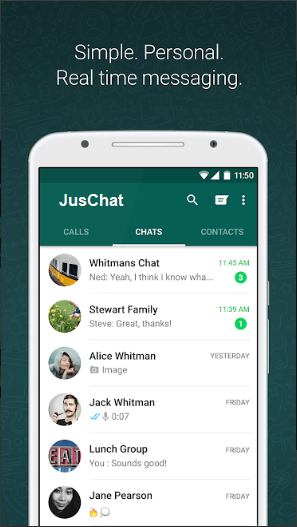
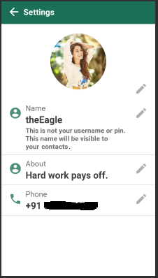

# JusChat- A Messaging App

  JusChat Messenger is a FREE messaging app available for Android.
  JusChat uses your phone's Internet connection (4G/3G/2G/EDGE or Wi-Fi, as available) 
  to let you message with friends and family. Switch from SMS to WhatsApp to send and 
  receive messages. 
Right Now JusChat only offers messaging service but the app is under progress and soon  
we will add some amazing features like sending calls, photos, videos, documents, and Voice Messages.

